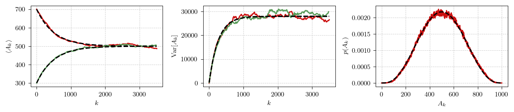

# Noisy voter model with poll-induced delays

Here we share a Python implementation of a noisy voter model with
poll-induced delays. The model itself was introduced in [1]. Here we just
briefly discuss the differences between the "usual" noisy voter model and
how to use our implementation.

In the noisy voter model only one agent (of $N$) is allowed to change their
state (opinion) at any single time. Therefore the model is completely
described by two rates: one corresponding to an agent switching from state
"0" to state "1" (letting $X$ be the number of agents in state "1"):

$$ \lambda (X \rightarrow X + 1)=\lambda^+=(N-X)\cdot\left[\varepsilon_1 + X\right], $$

and the other corresponding to agent switching from state "1" to state "0":

$$ \lambda (X \rightarrow X - 1 )=\lambda^-=X\cdot\left[\varepsilon_0 + (N-X)\right]. $$

These rates correspond to the "non-extensive" parametrization of the noisy
voter model. In this parametrization the model converges to a steady state
distribution even in the thermodynamic limit ($N \rightarrow \infty$),
instead of converging to a fixed point as is common in the existing
literature.

We introduce polls by rewriting the peer-pressure (or imitation) terms in
the rates to be time-delayed:

$$ \lambda^+(t)=\left(N-X(t)\right)\cdot\left[\varepsilon_1 + X\left(\left\lfloor\frac{t}{\tau} - 1\right\rfloor\tau\right)\right], $$

$$ \lambda^-(t)=X(t)\cdot\left[\varepsilon_0 + \left(N-X\left(\left\lfloor\frac{t}{\tau} - 1\right\rfloor\tau\right)\right)\right]. $$

In the above $\tau$ stands for both polling period, and the delay to the
announcement of the poll outcome. So, effectively every $t=k\tau$ (with
$k=0,1,2,\ldots$) an outcome of a previous poll $A_{k-1}$ (conducted at $t=(k-1)\tau$)
is announced to the agents, and a new poll $A_k$ is conducted (this outcome
will be announced at $t=(k+1)\tau$).

It is trivial to see that for small $\tau$ the time-delayed model is
equivalent to the original model, but for larger $\tau$ interesting
phenomena emerge (see [1] for details).

## Requirements

* numpy (tested with 1.26.4)
* numba (tested with 0.59)

## Usage of the macroscopic simulation method

This method was developed specifically for the poll-delayed model, it is a
more efficient way to simulate the model when $\tau$ is large, because it
does not simulate individual transitions, but only the outcomes of the
polls.

Below you can see a sample code for a typical model run. This code simulates
$10^3$ trajectories (which we collectively refer to as ensemble) with the
same initial conditions and parameter sets. Every trajectory in the ensemble
is simulated up to $k=3500$. Then the program takes ensemble mean, ensemble
variance, and calculates probability mass function (both over ensemble, and
trajectories). All numerical simulations are hidden behind `generate_series`
function, which takes simulation parameters and initial conditions as its
inputs. For those interested in analytical predictions for the moments,
there are also `get_mean` and `get_var` functions which allow users to
obtain predicted values for the moments.

```python
import matplotlib.pyplot as plt
import numpy as np
from scipy.stats import betabinom  # type: ignore

from macro_sim import generate_series, get_mean, get_var

# setup simulation parameters
ensemble_size = 1000

n_polls = 3500
n_agents = 1000
epsi_0 = 2
epsi_1 = 2
tau = 0.03
initial_poll = int(np.ceil(0.3 * n_agents))
initial_state = int(np.ceil(0.7 * n_agents))

seed = 43061
seed_inc = 273

# generate ensemble of trajectories
ensemble = np.array(
    [
        generate_series(
            n_polls,
            tau=tau,
            epsi_0=epsi_0,
            epsi_1=epsi_1,
            n_agents=n_agents,
            initial_state=initial_state,
            initial_poll=initial_poll,
            seed=seed + i * seed_inc,
        )
        for i in range(ensemble_size)
    ]
)

# calculate mean and variance over ensemble
poll_ids = np.arange(0, n_polls + 1, 1)
mean_series = np.mean(ensemble, axis=0)
var_series = np.var(ensemble, axis=0)

# determine simulated PMF
#
# PMF is taken both over ensemble, and over trajectories to get a better
# quality picture
bin_edges = np.arange(-0.5, n_agents + 0.5, 1)
bin_counts = np.histogram(ensemble[:, -1000:], bins=bin_edges)[0]
bin_centers = (bin_edges[1:] + bin_edges[:-1]) / 2
del bin_edges

# calculate analytical results
theory_mean = get_mean(
    poll_ids, epsi_0=epsi_0, epsi_1=epsi_1, initial_state=initial_state,
    initial_poll=initial_poll
)
theory_var = get_var(
    poll_ids, epsi_0=epsi_0, epsi_1=epsi_1, initial_state=initial_state,
    initial_poll=initial_poll
)
theory_pmf = betabinom.pmf(bin_centers, n_agents, 2 * epsi_1, 2 * epsi_0)

# plot the figure
plt.figure(figsize=(9, 2))
plt.subplot(131)
plt.xlabel(r"$k$")
plt.ylabel(r"$\langle A_k\rangle$")
plt.plot(poll_ids[::2][::10], mean_series[::2][::10])
plt.plot(poll_ids[::2][::10], theory_mean[::2][::10], "k--")
plt.plot(poll_ids[1::2][::10], mean_series[1::2][::10])
plt.plot(poll_ids[1::2][::10], theory_mean[1::2][::10], "k--")
plt.subplot(132)
plt.xlabel(r"$k$")
plt.ylabel(r"$\text{Var}[A_k]$")
plt.plot(poll_ids[::2][::10], var_series[::2][::10])
plt.plot(poll_ids[::2][::10], theory_var[::2][::10], "k--")
plt.plot(poll_ids[1::2][::10], var_series[1::2][::10])
plt.plot(poll_ids[1::2][::10], theory_var[1::2][::10], "k--")
plt.subplot(133)
plt.xlabel(r"$A_k$")
plt.ylabel(r"$p(A_k)$")
plt.plot(bin_centers, bin_counts / np.sum(bin_counts))
plt.plot(bin_centers, theory_pmf, "k--")
plt.tight_layout()
plt.show()
```

The code above should produce the figure below.

<div align="center">
  
</div>

## License

If you like the code presented here, you may use it for your purposes.
Though, if you find the model interesting, referencing the paper would be
highly appreciated.

## References

1. A. Kononovicius, R. Astrauskas, M. Radavičius, F. Ivanauskas. *Delayed
   interactions in the noisy voter model through the periodic polling
   mechanism*. (in preparation). [arXiv:2403.10277
   [physics.soc-ph]](https://arxiv.org/abs/2403.10277).
