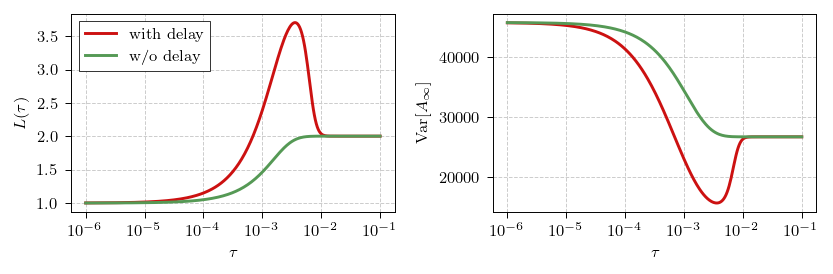

# Noisy voter model with poll-induced delays

Here we share a Python implementation of a noisy voter model with
poll-induced delays. The model itself was introduced in [1]. Here we just
briefly discuss the differences between the "usual" noisy voter model and
how to use our implementation.

In the noisy voter model only one agent (of <nobr>$N$)</nobr> is allowed to change their
state (opinion) at any single time. Therefore the model is completely
described by two rates: one corresponding to an agent switching from state
"0" to state "1" (letting $X$ be the number of agents in state "1"):

$$ \lambda (X \rightarrow X + 1)=\lambda^+=(N-X)\cdot\left[\varepsilon_1 + X\right], $$

and the other corresponding to agent switching from state "1" to state "0":

$$ \lambda (X \rightarrow X - 1 )=\lambda^-=X\cdot\left[\varepsilon_0 + (N-X)\right]. $$

These rates correspond to the "non-extensive" parametrization of the noisy
voter model. In this parametrization the model converges to a steady state
distribution even in the thermodynamic limit <nobr>($N \rightarrow \infty$)</nobr>,
instead of converging to a fixed point as is common in the existing
literature.

We introduce polls by rewriting the peer-pressure (or imitation) terms in
the rates to be time-delayed:

$$ \lambda^+(t)=\left(N-X(t)\right)\cdot\left[\varepsilon_1 + X\left(\left\lfloor\frac{t}{\tau} - 1\right\rfloor\tau\right)\right], $$

$$ \lambda^-(t)=X(t)\cdot\left[\varepsilon_0 + \left(N-X\left(\left\lfloor\frac{t}{\tau} - 1\right\rfloor\tau\right)\right)\right]. $$

In the above $\tau$ stands for both polling period, and the delay to the
announcement of the poll outcome. So, effectively every $t=k\tau$ (with
<nobr>$k=0,1,2,\ldots$)</nobr> an outcome of a previous poll $A_{k-1}$ (conducted at <nobr>$t=(k-1)\tau$)</nobr>
is announced to the agents, and a new poll $A_k$ is conducted (this outcome
will be announced at <nobr>$t=(k+1)\tau$)</nobr>.

It is trivial to see that for small $\tau$ the time-delayed model is
equivalent to the original model, but for larger $\tau$ interesting
phenomena emerge (see [1] for details).

## Requirements

* numpy (tested with 1.26.4)
* scipy (tested with 1.12)
* numba (tested with 0.59)

## Table of contents

- [Usage of the adapted Gillespie method](#usage-of-the-adapted-gillespie-method)
- [Usage of the macroscopic simulation method](#usage-of-the-macroscopic-simulation-method)
- [Usage of the semi-analytical (Markov chain) method](#usage-of-the-semi-analytical-(markov-chain)-method)
- [Obtaining the scaling law](#obtaining-the-scaling-law)
- [License](#license)
- [References](#references)

## Usage of the adapted Gillespie method

This method follows the original Gillespie method, but modifies it to take
into account delays specific to the poll-delayed noisy voter model. We have
found it to be somewhat faster than the more general next reaction method.

The code below simulates and plots a sample trajectory of the poll-delayed
model. Simulation is conducted up to the fifth poll (i.e., until
<nobr>$t=5\tau$</nobr>), in between each poll <nobr>$100$</nobr> equidistant
sampled values are retained.

```python
import matplotlib.pyplot as plt
import numpy as np

from gillespie_sim import generate_series

# set simulation parameters
n_polls = 5
n_inter = 100

tau = 1e-2
epsi = 1.0
n_agents = 100

initial_state = 70
initial_poll = 30

seed = 10459

# generate trajectory
series = generate_series(
    n_polls,
    tau=tau,
    n_inter=n_inter,
    epsi_0=epsi,
    epsi_1=epsi,
    n_agents=n_agents,
    initial_state=initial_state,
    initial_poll=initial_poll,
    seed=seed,
)
poll_indices = np.linspace(0, n_polls, n_polls * n_inter + 1)

# plot the trajectory
plt.figure()
plt.xlabel(r"$t / \tau$")
plt.ylabel(r"$X(t)$")
plt.plot(poll_indices, series)
plt.show()
```

The code above should produce the figure below.

<div align="center">
  
</div>

## Usage of the macroscopic simulation method

This method was developed specifically for the poll-delayed model, it is a
more efficient way to simulate the model when $\tau$ is large, because it
does not simulate individual transitions, but only the outcomes of the
polls.

Below you can see a sample code for a typical model run. This code simulates
$10^3$ trajectories (which we collectively refer to as ensemble) with the
same initial conditions and parameter sets. Every trajectory in the ensemble
is simulated up to <nobr>$k=3500$.</nobr> Then the program takes ensemble mean, ensemble
variance, and calculates probability mass function (both over ensemble, and
trajectories). All numerical simulations are hidden behind `generate_series`
function, which takes simulation parameters and initial conditions as its
inputs. For those interested in analytical predictions for the moments,
there are also `get_mean` and `get_var` functions which allow users to
obtain predicted values for the moments.

```python
import matplotlib.pyplot as plt
import numpy as np
from scipy.stats import betabinom  # type: ignore

from macro_sim import generate_series, get_mean, get_var

# setup simulation parameters
ensemble_size = 1000

n_polls = 3500
n_agents = 1000
epsi_0 = 2
epsi_1 = 2
tau = 0.03
initial_poll = int(np.ceil(0.3 * n_agents))
initial_state = int(np.ceil(0.7 * n_agents))

seed = 43061
seed_inc = 273

# generate ensemble of trajectories
ensemble = np.array(
    [
        generate_series(
            n_polls,
            tau=tau,
            epsi_0=epsi_0,
            epsi_1=epsi_1,
            n_agents=n_agents,
            initial_state=initial_state,
            initial_poll=initial_poll,
            seed=seed + i * seed_inc,
        )
        for i in range(ensemble_size)
    ]
)

# calculate mean and variance over ensemble
poll_ids = np.arange(0, n_polls + 1, 1)
mean_series = np.mean(ensemble, axis=0)
var_series = np.var(ensemble, axis=0)

# determine simulated PMF
#
# PMF is taken both over ensemble, and over trajectories to get a better
# quality picture
bin_edges = np.arange(-0.5, n_agents + 0.5, 1)
bin_counts = np.histogram(ensemble[:, -1000:], bins=bin_edges)[0]
bin_centers = (bin_edges[1:] + bin_edges[:-1]) / 2
del bin_edges

# calculate analytical results
theory_mean = get_mean(
    poll_ids, epsi_0=epsi_0, epsi_1=epsi_1, initial_state=initial_state,
    initial_poll=initial_poll
)
theory_var = get_var(
    poll_ids, epsi_0=epsi_0, epsi_1=epsi_1, initial_state=initial_state,
    initial_poll=initial_poll
)
theory_pmf = betabinom.pmf(bin_centers, n_agents, 2 * epsi_1, 2 * epsi_0)

# plot the figure
plt.figure(figsize=(9, 2))
plt.subplot(131)
plt.xlabel(r"$k$")
plt.ylabel(r"$\langle A_k\rangle$")
plt.plot(poll_ids[::2][::10], mean_series[::2][::10])
plt.plot(poll_ids[::2][::10], theory_mean[::2][::10], "k--")
plt.plot(poll_ids[1::2][::10], mean_series[1::2][::10])
plt.plot(poll_ids[1::2][::10], theory_mean[1::2][::10], "k--")
plt.subplot(132)
plt.xlabel(r"$k$")
plt.ylabel(r"$\text{Var}[A_k]$")
plt.plot(poll_ids[::2][::10], var_series[::2][::10])
plt.plot(poll_ids[::2][::10], theory_var[::2][::10], "k--")
plt.plot(poll_ids[1::2][::10], var_series[1::2][::10])
plt.plot(poll_ids[1::2][::10], theory_var[1::2][::10], "k--")
plt.subplot(133)
plt.xlabel(r"$A_k$")
plt.ylabel(r"$p(A_k)$")
plt.plot(bin_centers, bin_counts / np.sum(bin_counts))
plt.plot(bin_centers, theory_pmf, "k--")
plt.tight_layout()
plt.show()
```

The code above should produce the figure below.

<div align="center">
  
</div>

## Usage of the semi-analytical (Markov chain) method

This method relies on building the transition matrix (extremely time
consuming) and then either "simulating" it for set number of steps (using
`simulate_pmfs` function), or solving the eigenproblem to get stationary PMF
(using `get_stationary_pmf` function). If you need, you can also obtain
transition matrix and use it for your other purposes (use
`make_transition_matrix` function).

Code below calculates poll outcome PMFs over $1000$ steps (single step
corresponds to single polling period). Figure of PMF evolution is then
obtained and plotted.

```python
import matplotlib.pyplot as plt
import numpy as np
from matplotlib import colormaps
from mc_sim import simulate_pmfs
from scipy.stats import betabinom

# set simulation parameters
n_steps = 1000

tau = 1
epsi_0 = 2
epsi_1 = 2
n_agents = 100

# obtain PMF history
history = simulate_pmfs(
    n_steps, tau=tau, epsi_0=epsi_0, epsi_1=epsi_1, n_agents=n_agents
)

# plot the figure
plt.figure(figsize=(3, 2))
plt.semilogy()
plt.xlabel(r"$A_k$")
plt.ylabel(r"$p(A_k)$")
plt.ylim([1e-7, 2e1])
for idx, h in enumerate(history):
    plt.plot(
        h[:, 0], h[:, 1], c=colormaps["coolwarm"](1 - (1 - idx / len(history)) ** 20)
    )
X = np.arange(0, n_agents + 1)
plt.plot(X, betabinom.pmf(X, n_agents, 2 * epsi_1, 2 * epsi_0), "k--")
plt.show()
```

The code above should produce the figure below.

<div align="center">
  
</div>

## Obtaining the scaling law

In [1] we have observed that for any polling period the stationary
distribution of the model is well approximated by the Beta-binomial
distribution. With the shape parameters of the distribution scaling
according to a non-trivial law. `ar2` module contains `get_scaling_law`
function, which calculates the law <nobr>$L(\tau)$</nobr> for the given
model parameters. Recall that <nobr>$\hat{\alpha}(\tau) = \varepsilon\_1
L(\tau)$</nobr> and <nobr>$\hat{\beta}(\tau) = \varepsilon\_0
L(\tau)$</nobr> [1], so you'll have to multiply by corresponding parameter
value to get the expected shape parameter values.

The code below generates two plots by relying on analytical results obtained
with AR(2) approach. The left subplot shows the scaling law of the shape
parameters, and the right subplot shows how the stationary variance scales
with the polling period. Calculation of the stationary variance relies on
a hidden function `_get_variance`.

```python
import matplotlib.pyplot as plt
import numpy as np

from ar2 import get_scaling_law
from ar2.theory import _get_variance

taus = np.logspace(-6, -1, 301)

epsi_0 = 0.5
epsi_1 = 2.0
n_agents = 1000

law = get_scaling_law(taus, epsi_0=epsi_0, epsi_1=epsi_1, n_agents=n_agents)
var = _get_variance(taus, epsi_0=epsi_0, epsi_1=epsi_1, n_agents=n_agents)

plt.figure(figsize=(6, 2))
plt.subplot(121)
plt.xlabel(r"$\tau$")
plt.ylabel(r"$L(\tau)$")
plt.semilogx()
plt.minorticks_off()
plt.plot(taus, law)
plt.subplot(122)
plt.xlabel(r"$\tau$")
plt.ylabel(r"$\mathrm{Var}[A_\infty]$")
plt.semilogx()
plt.minorticks_off()
plt.plot(taus, var)
plt.tight_layout()
plt.show()
```

The code above should produce the figure below.

<div align="center">
  
</div>

## License

If you like the code presented here, you may use it for your purposes.
Though, if you find the model interesting, referencing the paper would be
highly appreciated.

## References

1. A. Kononovicius, R. Astrauskas, M. Radavičius, F. Ivanauskas. *Delayed
   interactions in the noisy voter model through the periodic polling
   mechanism*. (in preparation). [arXiv:2403.10277
   [physics.soc-ph]](https://arxiv.org/abs/2403.10277).
